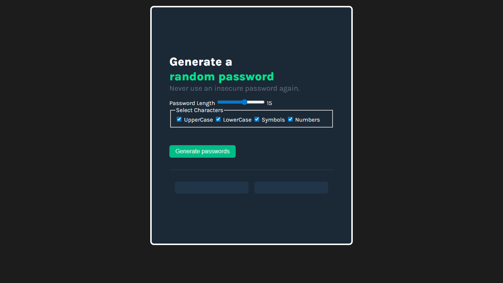

# Random Password Generator

A simple and interactive random password generator built as a Scrimba solo project.

## Live Demo


[Live Preview](https://anik-hindu.github.io/random-password-generator)

## Description

This project generates secure random passwords based on user-defined criteria. Users can specify the password length and choose which character types to include (uppercase letters, lowercase letters, numbers, and special characters).

## Features

- ✨ Generate random passwords with custom length
- 🔤 Include/exclude uppercase letters
- 🔡 Include/exclude lowercase letters
- 🔢 Include/exclude numbers
- 🔣 Include/exclude special characters
- 📋 Copy password to clipboard
- 🎨 Clean and user-friendly interface

## Technologies Used

- **HTML** - Structure
- **CSS** - Styling and layout
- **JavaScript** - Password generation logic

## How to Use

1. Open `index.html` in your web browser
2. Set your desired password length using the input field or slider
3. Select which character types you want to include
4. Click the "Generate Password" button
5. Click the generated password to copy it to your clipboard

## Project Structure

```
├── index.html
├── style.css
├── script.js
└── screenshot.png
└── README.md
```

## Installation

No installation required! Simply clone or download this repository and open `index.html` in your browser.

```bash
git clone https://github.com/yourusername/random-password-generator.git
cd random-password-generator
open index.html
```

## Example

Input:

- Password Length: 16
- Include: Uppercase, Lowercase, Numbers, Special Characters

Output: `K7#mP2@xL9$qRvW1`

## Future Enhancements

- [ ] Add password strength indicator
- [ ] Add custom character set option
- [ ] Add password history
- [ ] Generate multiple passwords at once
- [ ] Add settings to customize excluded characters

## Learning Outcomes

Through this project, I learned:

- How to generate random numbers in JavaScript
- String manipulation and concatenation
- DOM manipulation and event handling
- User input validation
- Clipboard API usage
